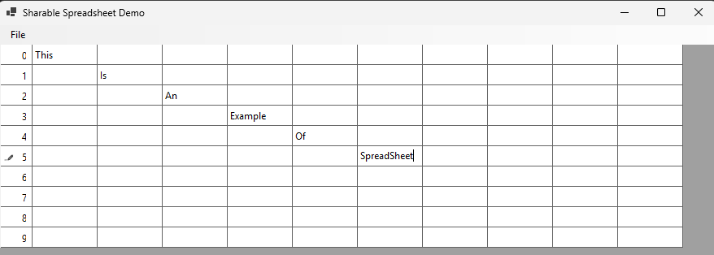

# Thread-Safe Shared Spreadsheet

This project implements a high-performance, in-memory spreadsheet data structure designed for concurrent, multi-threaded access. The system is built to mimic the core logic of a collaborative spreadsheet application, like Google Sheets, where multiple users can perform operations simultaneously.

## Key Features

* **Thread-Safety:** The spreadsheet is designed from the ground up to be fully thread-safe, ensuring data integrity and consistency under heavy concurrent load.
* **Dynamic Sizing:** The spreadsheet can be dynamically resized by adding or removing rows and columns.
* **Persistence:** The spreadsheet data can be saved to and loaded from a text file, allowing for easy data serialization.

## Architectural Design

### Fine-Grained Locking Strategy

To achieve high concurrency and avoid performance bottlenecks, a fine-grained locking strategy is employed. Instead of using a single global lock that would block all operations, the system uses multiple mutexes to protect specific parts of the data.

* **Scalable Mutex Allocation:** The number of mutexes is a configurable parameter (`users`), which allows the system to scale its synchronization resources based on the expected number of concurrent users.
* **Cell-to-Mutex Mapping:** Each cell is mapped to a specific mutex, allowing for independent, concurrent operations on different cells.
* **Deadlock Prevention:** For operations that affect multiple cells (e.g., exchanging rows or columns), the system gathers all required locks, sorts them into a canonical order (by their hash code), acquires them sequentially, and then releases them in reverse order. This robust strategy guarantees that no deadlocks can occur.

## Technologies

* **Language:** C#
* **Concurrency:** `System.Threading.Mutex`

## Getting Started

### Prerequisites

To build and run the project, you need:
* .NET SDK (version 6.0 or higher)

### How to Build

1.  Clone this repository to your local machine.
2.  Navigate to the project directory containing `SharableSpreadSheet.cs`.
3.  You can use this class in any C# project.

### Usage

The `SharableSpreadSheet` class provides a full suite of methods for manipulating the spreadsheet:

* `getCell(row, col)`: Retrieves the value of a cell.
* `setCell(row, col, str)`: Sets the value of a cell.
* `exchangeRows(row1, row2)`: Swaps the contents of two rows.
* `save(fileName)`: Saves the current state of the spreadsheet.

## Related Projects and Future Enhancements

* **Multi-User Simulator:** A console application to stress-test the `SharableSpreadSheet` class with a configurable number of concurrent threads and random operations.
* **Spreadsheet GUI:** A graphical user interface (GUI) application was developed to demonstrate the functionality of the SharableSpreadSheet class. This application allows users to visualize and interact with the spreadsheet through basic operations like loading, saving, and editing cells.

---
**Note:** The codebase for the simulator and GUI projects are available in their respective directories within this repository.

